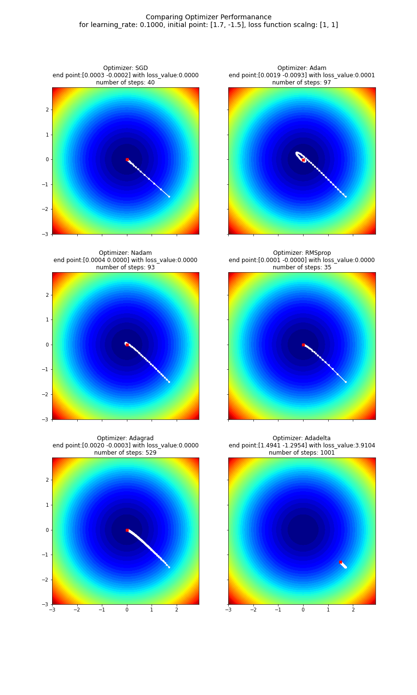

# Experiments with TF Optimizers

Work inspired by J. Brownlee's [blog posting](https://machinelearningmastery.com/gradient-descent-optimization-with-nadam-from-scratch/)

Notebook `optimizer_playground.ipynb` provides a means to see how TF's different optimizers behave.  It should be noted the "loss values" generated in the notebook are for demonstration purposes only and not intended portray actual loss values encountered during deep neural network training.

## Simple Loss Example
Illustrative Loss Surface

Contour plot

Comparision of TF Optimizers on the Simple Loss Example

## More Complex Loss Example
Illustrative Loss Surface

Contour plot

Comparision of TF Optimizers on the Complex Loss Example

