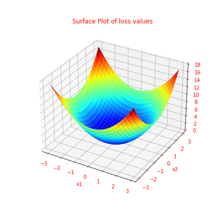
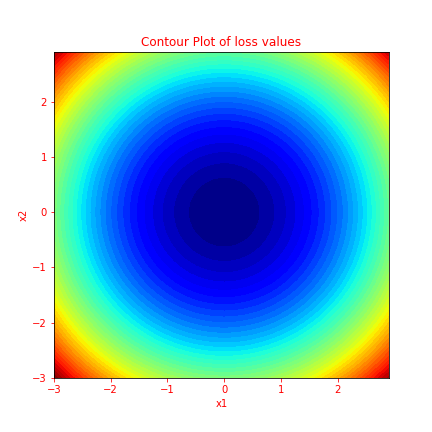
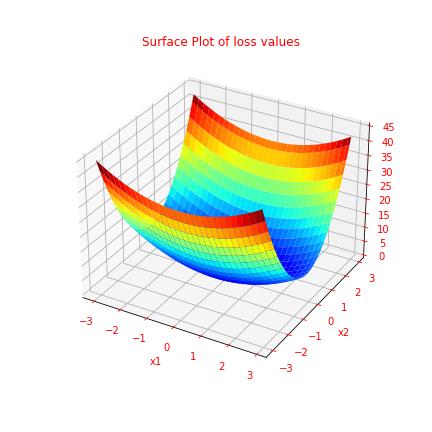
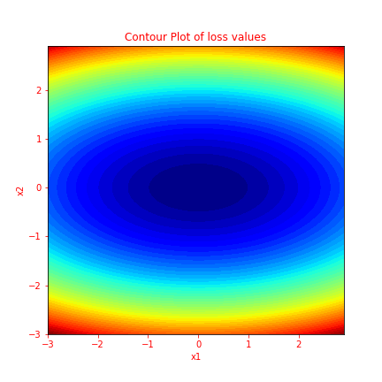
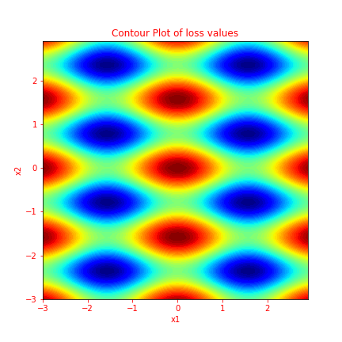
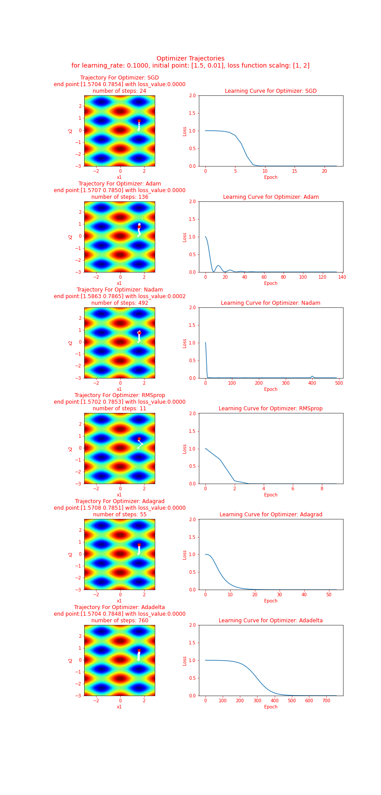
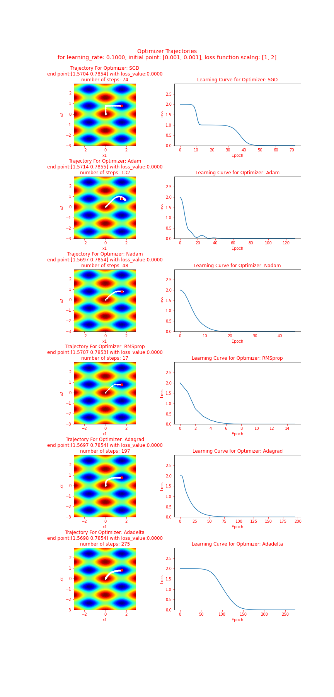

# Experiments with TF Optimizers

Work inspired by J. Brownlee's [blog posting](https://machinelearningmastery.com/gradient-descent-optimization-with-nadam-from-scratch/)

Notebook `optimizer_playground.ipynb` provides a means to see how TF's different optimizers behave.  It should be noted the "loss values" generated in the notebook are for demonstration purposes only and not intended portray actual loss values encountered during deep neural network training.

Tensorflow Keras Optimizers tested:
* `tf.keras.optimizers.SGD`
* `tf.keras.optimizers.Adam`
* `tf.keras.optimizers.Nadam`
* `tf.keras.optimizers.RMSprop`
* `tf.keras.optimizers.Adagrad`
* `tf.keras.optimizers.Adadelta`

## Bowl Loss Example
Illustrative Convex Loss Surface - Shaped as a bowl

Contour plot

Comparison of TF Optimizers on the Simple Loss Example (Note: red "X" indicates estimated location for minimum loss.)

## Valley Loss Example
Illustrative Convex Loss Surface - Shaped as a valley

Contour plot

Comparison of TF Optimizers on the Simple Loss Example (Note: red "X" indicates estimated location for minimum loss.)

## Non-Convex Loss Example
Complex Loss Surface - multiple min and max points

Contour plot

Comparison of TF Optimizers on the Complex Loss Example (Note: red "X" indicates estimated location with minimum loss.)

## Another Non-Convex Loss Example

Comparison of TF Optimizers on the Complex Loss Example (Note: red "X" indicates estimated location with minimum loss.)

## Extreme Loss Example - Initial Point is Local Maximum

Comparison of TF Optimizers on the Complex Loss Example (Note: red "X" indicates estimated location with minimum loss.)

